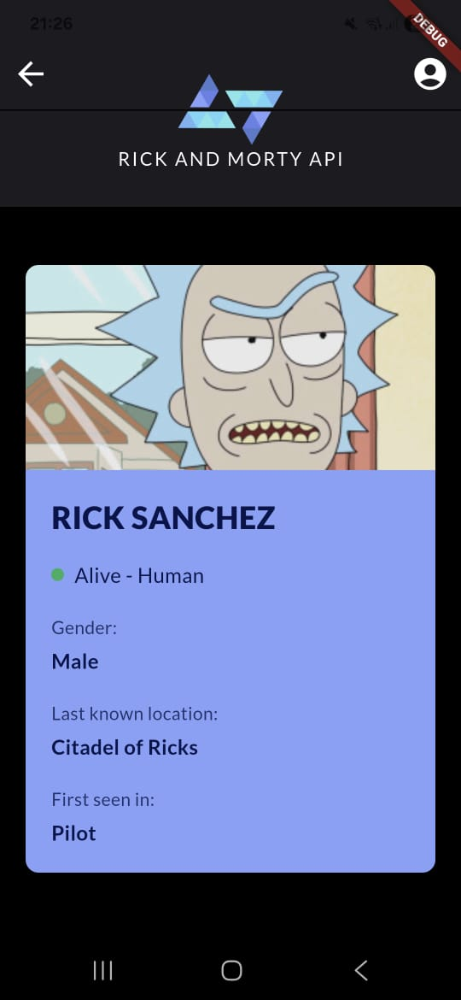
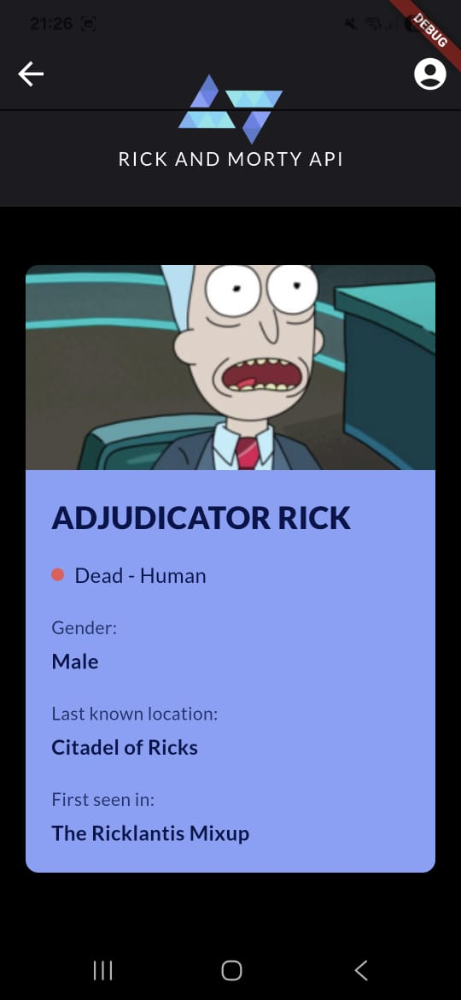
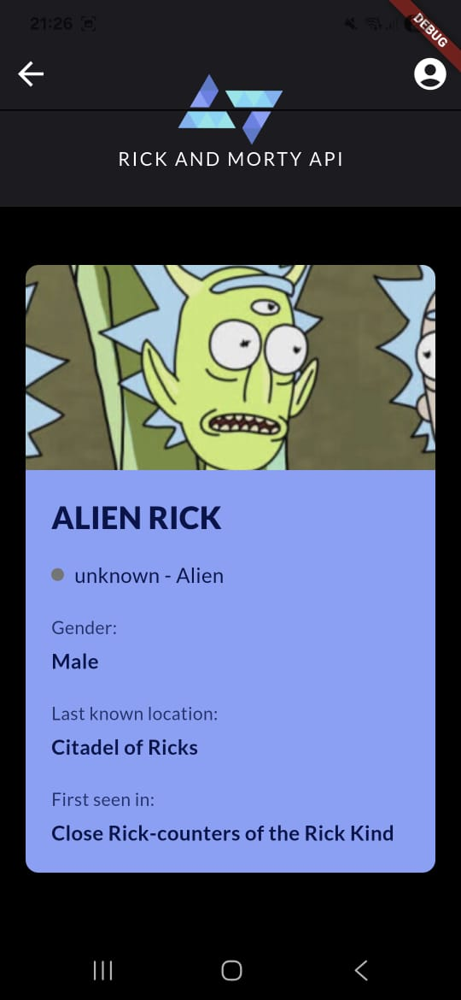
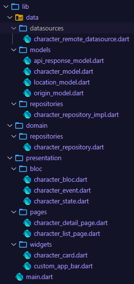

# Rick & Morty API - Desafio Técnico Kode Start 2025

## Funcionalidades Desenvolvidas:

✅ Listagem de Personagens com Scroll Infinito: A tela principal carrega os personagens da API e busca novas páginas automaticamente conforme o usuário rola a lista.

✅ Busca por Nome com Debounce:

O campo de busca permite filtrar personagens por nome (parcial ou completo). A busca é otimizada com "debounce", que evita chamadas excessivas à API.

✅ Tela de Detalhes do Personagem:

Exibe informações como status, espécie, gênero, localização e primeira aparição.

✅ Navegação entre telas:

✅ Nenhum personagem encontrado:

##  Arquitetura e Padrões de Projeto

### Domain (Domínio):

Responsabilidade: Contém a lógica de negócio pura e os "contratos" (classes abstratas) que definem o que a aplicação pode fazer.

### Data (Dados):

Responsabilidade: Implementa os contratos definidos na camada de Domínio e onde o aplicativo interage com a API.

### Presentation (Apresentação):

Responsabilidade: Exibe os dados na tela e lida com a interação do usuário.

## Descrição Detalhada do Desenvolvimento
1. UI e Design Responsivo
Componentização: A UI foi construída de forma modular. Widgets como CustomAppBar e CharacterCard foram criados em arquivos separados, permitindo sua reutilização e facilitando a manutenção.

2. Safe Area: O layout leva em consideração as áreas de sistema (barra de status no topo e barra de navegação na base). A altura do header é calculada dinamicamente (topSafeAreaHeight + 55px) e um padding é adicionado ao final da lista (40px + bottomSafeAreaHeight), garantindo que nenhum conteúdo seja obstruído em dispositivos com notch ou diferentes tipos de navegação.

3. Lógica de Estado e Performance
BLoC: O padrão BLoC foi usado para separar a lógica de negócio da UI. O fluxo Evento -> BLoC -> Estado garante um fluxo de dados unidirecional e previsível, facilitando o debug e a manutenção.

4. Debounce na Busca: Para otimizar a performance e a experiência do usuário, a funcionalidade de busca utiliza um Timer para criar um "debounce" de 500ms. Isso significa que uma chamada à API só é feita quando o usuário para de digitar, evitando uma avalanche de requisições desnecessárias.

5. Paginação Robusta: O scroll infinito foi implementado com um ScrollController. A lógica para determinar o fim da lista foi refinada para usar o campo info.next da resposta da API, em vez de simplesmente verificar se a última lista recebida estava vazia. Isso corrige bugs em buscas que retornam um número de resultados que é múltiplo do tamanho da página.

6. Cache de Imagens: O pacote cached_network_image é utilizado para carregar as imagens dos personagens. Ele automaticamente armazena as imagens em cache, resultando em carregamentos mais rápidos quando o usuário rola a lista para cima e para baixo ou revisita a tela.